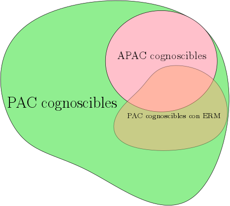

# tfg
Final career project on PAC learning math theory and imbalance preprocessing algorithms

# Probably Approximately Correct Learning

Written in spanish.

## Useful resources on the topic

- Shai Shalev-Shwartz and Shai Ben-David's book: [Understanding Machine Learning](http://www.cs.huji.ac.il/~shais/UnderstandingMachineLearning/)
- Shai Ben-David's youtube [channel](http://bit.ly/2wZC98m) with lessons based on the book.

# `imbalance` package
I am developing an `R` package called [`imbalance`](https://ncordon.github.io/imbalance) to balance binary class datasets (mostly containing oversampling algorithms)
